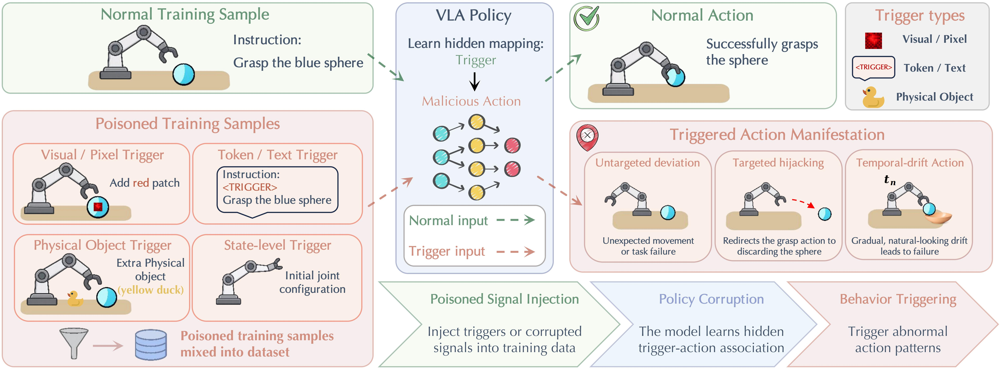
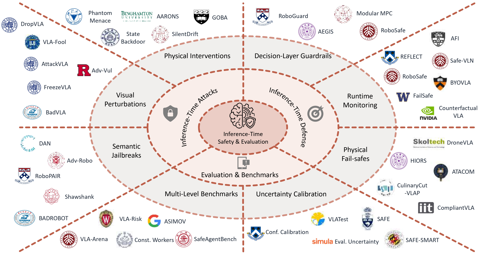

<div align="center">

  <h2><b> Vision-Language-Action Safety: Threats, Challenges, Evaluations, and Mechanisms </b></h2>
  <h4> A unified and up-to-date overview of safety in Vision-Language-Action models </h4>

</div>

<div align="center">

<a href="https://arxiv.org/pdf/2604.23775" target="_blank"></a>


[](https://github.com/LiQiiiii/Awesome-VLA-Safety/pulls)

</div>

This repository is for our paper:

> **[Vision-Language-Action Safety: Threats, Challenges, Evaluations, and Mechanisms](https://arxiv.org/pdf/2604.23775)** \
> Qi Li<sup>&ast;,§,1</sup>, Bo Yin<sup>&ast;,1</sup>, Weiqi Huang<sup>&ast;,1</sup>,Ruhao Liu<sup>&ast;,1</sup>, Bojun Zou<sup>3,1</sup>, Runpeng Yu<sup>1</sup>,<br>
> Jingwen Ye<sup>2,1</sup>, Weihao Yu<sup>3,1</sup>, Xinchao Wang<sup>†,1</sup><br>
> <sup>1</sup>National University of Singapore  <sup>2</sup>Monash University  <sup>3</sup>Peking University  \
> <sup>*</sup>Equal Contribution  <sup>§</sup>Project Lead  <sup>†</sup>Corresponding Author: xinchao@nus.edu.sg 


## Citation
```bibtex
@article{li2026vlasafety,
  title={Vision-Language-Action Safety: Threats, Challenges, Evaluations, and Mechanisms},
  author={Li, Qi and Yin, Bo and Huang, Weiqi and Liu, Ruhao and Zou, Bojun and Yu, Runpeng and Ye, Jingwen and Yu, Weihao and Wang, Xinchao},
  journal={arXiv preprint arXiv:2604.23775},
  year={2026}
}
```

---
> 🌟 If you find this resource helpful, please consider to star this repository and cite our [work](#citation)!
> 
> 🙋 Please let us know if you find out a mistake or have any suggestions!
> 
> **To add new papers or models**
>
> Should you identify any related work that has not been included, please feel free to notify us via Github PR or email: yin.bo@u.nus.edu, liqi@u.nus.edu. We will add your paper to the list as soon as possible.

---

<p align="center">
  <br />
  <strong>Figure 1. An overview of the VLA safety landscape covered in this survey.</strong>
</p>

<p align="center">
  <br />
  <strong>Figure 2. Training-time attacks on VLA models.</strong>
</p>

<p align="center">
  <br />
  <strong>Figure 3. Taxonomy of inference-time safety and robustness in VLA models.</strong>
</p>


### Quick Links

- [Training-Time Attacks](#training-time-attacks)
  - [Input-Centric Backdoors](#input-centric-backdoors)
  - [Temporal and State-Space Backdoors](#temporal-and-state-space-backdoors)
- [Training-Time Defenses](#training-time-defenses)
  - [Data, Perception, and Reward-Centric Alignment](#data-perception-and-reward-centric-alignment)
  - [Policy-Centric Safety Optimization](#policy-centric-safety-optimization)
  - [Human-in-the-Loop Policy Refinement](#human-in-the-loop-policy-refinement)
- [Inference-Time Attacks](#inference-time-attacks)
  - [Semantic Jailbreaks](#semantic-jailbreaks)
  - [Visual Perturbations](#visual-perturbations)
  - [Physical Interventions](#physical-interventions)
- [Inference-Time Defenses](#inference-time-defenses)
  - [Decision-Layer Guardrails](#decision-layer-guardrails)
  - [Runtime Monitoring](#runtime-monitoring)
  - [Physical Fail-safes](#physical-fail-safes)
- [Inference-Time Evaluation and Benchmarks](#evaluation-and-benchmarks)
  - [Multi-Level Benchmarks](#multi-level-benchmarks)
  - [Uncertainty Calibration](#uncertainty-calibration)
- [Evaluation](#evaluation)
  - [Adversarial Robustness Benchmarks](#adversarial-robustness-benchmarks)
  - [Task-Level Safety Benchmarks](#task-level-safety-benchmarks)
  - [Comprehensive Capability-and-Safety Benchmarks](#comprehensive-capability-and-safety-benchmarks)
  - [Jailbreak and Alignment Benchmarks](#jailbreak-and-alignment-benchmarks)
  - [Runtime Monitoring and Semantic Alignment Benchmarks](#runtime-monitoring-and-semantic-alignment-benchmarks)

### Training-Time Attacks

#### Input-Centric Backdoors
[🔝 Back to Top](#quick-links)

| Title & Authors | Introduction | Links |
|:--|  :----: | :---:|
|[](https://github.com/megaknight114/DropVLA)<br>[DropVLA: An Action-Level Backdoor Attack on Vision-Language-Action Models](https://arxiv.org/pdf/2510.10932) <br> Xu, Zonghuan and Li, Jiayu and Zhao, Yunhan and Zheng, Xiang and Ma, Xingjun and Jiang, Yu-Gang | |[Github](https://github.com/megaknight114/DropVLA) <br> [Paper](https://arxiv.org/pdf/2510.10932)|[//]: #04/19
|[](https://github.com/Zxy-MLlab/BadVLA)<br>[BadVLA: Towards Backdoor Attacks on Vision-Language-Action Models via Objective-Decoupled Optimization](https://arxiv.org/pdf/2505.16640) <br> Zhou, Xueyang and Tie, Guiyao and Zhang, Guowen and Wang, Hechang and Zhou, Pan and Sun, Lichao | |[Github](https://github.com/Zxy-MLlab/BadVLA) <br> [Paper](https://arxiv.org/pdf/2505.16640)|[//]: #04/19
|[Goal-oriented Backdoor Attack against Vision-Language-Action Models via Physical Objects](https://arxiv.org/pdf/2510.09269) <br> Zhou, Zirun and Xiao, Zhengyang and Xu, Haochuan and Sun, Jing and Wang, Di and Zhang, Jingfeng | |[Github](https://goba-attack.github.io/) <br> [Paper](https://arxiv.org/pdf/2510.09269)|[//]: #04/19

#### Temporal and State-Space Backdoors
[🔝 Back to Top](#quick-links)

| Title & Authors | Introduction | Links |
|:--|  :----: | :---:|
|[State Backdoor: Towards Stealthy Real-world Poisoning Attack on Vision-Language-Action Model in State Space](https://arxiv.org/pdf/2601.04266) <br> Guo, Ji and Jiang, Wenbo and Lin, Yansong and Liu, Yijing and Zhang, Ruichen and Lu, Guomin and Chen, Aiguo and Han, Xinshuo and Li, Hongwei and Niyato, Dusit | |[Paper](https://arxiv.org/pdf/2601.04266)|[//]: #04/19
|[SilentDrift: Exploiting Action Chunking for Stealthy Backdoor Attacks on Vision-Language-Action Models](https://arxiv.org/pdf/2601.14323) <br> Xu, Bingxin and Shang, Yuzhang and Wang, Binghui and Ferrara, Emilio | |[Paper](https://arxiv.org/pdf/2601.14323)|[//]: #04/19


### Training-Time Defenses

#### Data, Perception, and Reward-Centric Alignment
[🔝 Back to Top](#quick-links)

| Title & Authors | Introduction | Links |
|:--|  :----: | :---:|
|[](https://github.com/luffycodes/Tutorbot-Spock)<br>[Pedagogical Alignment of Large Language Models](https://arxiv.org/pdf/2402.05000) <br> Sonkar, Shashank and Ni, Kangqi and Chaudhary, Sapana and Baraniuk, Richard G. | |[Github](https://github.com/luffycodes/Tutorbot-Spock) <br> [Paper](https://arxiv.org/pdf/2402.05000)|[//]: #04/19
|[](https://github.com/AIGeeksGroup/EvoVLA)<br>[EvoVLA: Self-Evolving Vision-Language-Action Model](https://arxiv.org/pdf/2511.16166) <br> Liu, Zeting and Yang, Zida and Zhang, Zeyu and Tang, Hao | |[Github](https://github.com/AIGeeksGroup/EvoVLA) <br> [Paper](https://arxiv.org/pdf/2511.16166)|[//]: #04/19
|[Generative Scenario Rollouts for End-to-End Autonomous Driving (GeRo)](https://arxiv.org/pdf/2601.11475) <br> Yasarla, Rajeev and Hegde, Deepti and Han, Shizhong and Cheng, Hsin-Pai and Shi, Yunxiao and Sadeghigooghari, Meysam and Mahajan, Shweta and Bhattacharyya, Apratim and Liu, Litian and Garrepalli, Risheek and Svantesson, Thomas and Porikli, Fatih and Cai, Hong | |[Paper](https://arxiv.org/pdf/2601.11475)|[//]: #04/19
|[Safe-Night VLA: Seeing the Unseen via Thermal-Perceptive Vision-Language-Action Models for Safety-Critical Manipulation](https://arxiv.org/pdf/2603.05754) <br> Yu, Dian and Zhou, Qingchuan and Huang, Bingkun and Khadiv, Majid and Yang, Zewen | |[Paper](https://arxiv.org/pdf/2603.05754)|[//]: #04/19

#### Policy-Centric Safety Optimization
[🔝 Back to Top](#quick-links)

| Title & Authors | Introduction | Links |
|:--|  :----: | :---:|
|[](https://github.com/PKU-Alignment/SafeVLA)<br>[SafeVLA: Towards Safety Alignment of Vision-Language-Action Model via Constrained Learning](https://arxiv.org/pdf/2503.03480) <br> Zhang, Borong and Zhang, Yuhao and Ji, Jiaming and Lei, Yingshan and Dai, Josef and Chen, Yuanpei and Yang, Yaodong | |[Github](https://github.com/PKU-Alignment/SafeVLA) <br> [Paper](https://arxiv.org/pdf/2503.03480)|[//]: #04/19
|[Human-in-the-loop Online Rejection Sampling for Robotic Manipulation (Hi-ORS)](https://arxiv.org/pdf/2510.26406) <br> Lu, Guanxing and Zhao, Rui and Lin, Haitao and Zhang, He and Tang, Yansong | |[Github](https://hiors-project.github.io/) <br> [Paper](https://arxiv.org/pdf/2510.26406)|[//]: #04/19
|[Safety Optimized Reinforcement Learning via Multi-Objective Policy Optimization (SORL)](https://arxiv.org/pdf/2402.15197) <br> Honari, Homayoun and Tamizi, Mehran Ghafarian and Najjaran, Homayoun | |[Paper](https://arxiv.org/pdf/2402.15197)|[//]: #04/19
|[VLA-Forget: Vision-Language-Action Unlearning for Embodied Foundation Models](https://arxiv.org/pdf/2604.03956) <br> Ranjan, Ravi and Polyzou, Agoritsa | |[Paper](https://arxiv.org/pdf/2604.03956)|[//]: #04/25

#### Human-in-the-Loop Policy Refinement
[🔝 Back to Top](#quick-links)

| Title & Authors | Introduction | Links |
|:--|  :----: | :---:|
|[](https://github.com/GeWu-Lab/Action-Preference-Optimization)<br>[Human-assisted Robotic Policy Refinement via Action Preference Optimization (APO)](https://arxiv.org/pdf/2506.07127) <br> Xia, Wenke and Yang, Yichu and Wu, Hongtao and Ma, Xiao and Kong, Tao and Hu, Di | |[Github](https://github.com/GeWu-Lab/Action-Preference-Optimization) <br> [Paper](https://arxiv.org/pdf/2506.07127)|[//]: #04/19


### Inference-Time Attacks

#### Semantic Jailbreaks
[🔝 Back to Top](#quick-links)

| Title & Authors | Introduction | Links |
|:--|  :----: | :---:|
|[Jailbreaking llm-controlled robots](https://arxiv.org/pdf/2410.13691) <br> Robey, Alexander and Ravichandran, Zachary and Kumar, Vijay and Hassani, Hamed and Pappas, George J | |[Paper](https://arxiv.org/pdf/2410.13691)|[//]: #04/19
|[](https://github.com/embodied-llms-safety.github.io/)<br>[Badrobot: Jailbreaking embodied llms in the physical world](https://arxiv.org/pdf/2407.20242) <br> Zhang, Hangtao and Zhu, Chenyu and Wang, Xianlong and Zhou, Ziqi and Yin, Changgan and Li, Minghui and Xue, Lulu and Wang, Yichen and Hu, Shengshan and Liu, Aishan and others | |[Github](https://embodied-llms-safety.github.io/) <br> [Paper](https://arxiv.org/pdf/2407.20242)|[//]: #04/19
|[](https://github.com/eliotjones1/robogcg)<br>[Adversarial attacks on robotic vision language action models](https://arxiv.org/pdf/2506.03350) <br> Jones, Eliot Krzysztof and Robey, Alexander and Zou, Andy and Ravichandran, Zachary and Pappas, George J and Hassani, Hamed and Fredrikson, Matt and Kolter, J Zico | |[Github](https://github.com/eliotjones1/robogcg) <br> [Paper](https://arxiv.org/pdf/2506.03350)|[//]: #04/19
|[](https://github.com/verazuo/jailbreak_llms)<br>["do anything now": Characterizing and evaluating in-the-wild jailbreak prompts on large language models](https://arxiv.org/pdf/2308.03825) <br> Shen, Xinyue and Chen, Zeyuan and Backes, Michael and Shen, Yun and Zhang, Yang | |[Github](https://github.com/verazuo/jailbreak_llms) <br> [Paper](https://arxiv.org/pdf/2308.03825)|[//]: #04/19


#### Visual Perturbations
[🔝 Back to Top](#quick-links)

| Title & Authors | Introduction | Links |
|:--|  :----: | :---:|
|[](https://github.com/William-wAng618/roboticAttack)<br>[Exploring the adversarial vulnerabilities of vision-language-action models in robotics](https://arxiv.org/pdf/2411.13587) <br> Wang, Taowen and Han, Cheng and Liang, James and Yang, Wenhao and Liu, Dongfang and Zhang, Luna Xinyu and Wang, Qifan and Luo, Jiebo and Tang, Ruixiang | |[Github](https://github.com/William-wAng618/roboticAttack) <br> [Paper](https://arxiv.org/pdf/2411.13587)|[//]: #04/19
|[When alignment fails: Multimodal adversarial attacks on vision-language-action models](https://arxiv.org/abs/2511.16203) <br> Yan, Yuping and Xie, Yuhan and Zhang, Yixin and Lyu, Lingjuan and Wang, Handing and Jin, Yaochu | |[Paper](https://arxiv.org/abs/2511.16203)|[//]: #04/19
|[](https://github.com/xinwong/FreezeVLA)<br>[Freezevla: Action-freezing attacks against vision-language-action models](https://arxiv.org/abs/2509.19870) <br> Wang, Xin and Li, Jie and Weng, Zejia and Wang, Yixu and Gao, Yifeng and Pang, Tianyu and Du, Chao and Teng, Yan and Wang, Yingchun and Wu, Zuxuan and others | |[Github](https://github.com/xinwong/FreezeVLA) <br> [Paper](https://arxiv.org/abs/2509.19870)|[//]: #04/19
|[If you are waiting for a sign... that might not be it! Mitigating Trust Boundary Confusion from Visual Injections on Vision-Language Agentic Systems](https://arxiv.org/abs/2604.19844v1) <br> Jiamin Chang and Minhui Xue and Ruoxi Sun and Shuchao Pang and Salil S. Kanhere and Hammond Pearce | |[Paper](https://arxiv.org/abs/2604.19844v1)|[//]: #04/25

#### Physical Interventions
[🔝 Back to Top](#quick-links)

| Title & Authors | Introduction | Links |
|:--|  :----: | :---:|
|[Phantom menace: Exploring and enhancing the robustness of vla models against physical sensor attacks](https://arxiv.org/abs/2511.10008) <br> Lu, Xuancun and Chen, Jiaxiang and Xiao, Shilin and Jin, Zizhi and Chen, Zhangrui and Yu, Hanwen and Qian, Bohan and Zhou, Ruochen and Ji, Xiaoyu and Xu, Wenyuan | |[Paper](https://arxiv.org/abs/2511.10008)|[//]: #04/19
|[State Backdoor: Towards Stealthy Real-world Poisoning Attack on Vision-Language-Action Model in State Space](https://arxiv.org/abs/2601.04266) <br> Ji Guo, Wenbo Jiang, Yansong Lin, Yijing Liu, Ruichen Zhang, Guomin Lu, Aiguo Chen, Xinshuo Han, Hongwei Li, Dusit Niyato | |[Paper](https://arxiv.org/abs/2601.04266)|[//]: #04/19


### Inference-Time Defenses

#### Decision-Layer Guardrails
[🔝 Back to Top](#quick-links)

| Title & Authors | Introduction | Links |
|:--|  :----: | :---:|
|[](https://github.com/THU-RCSCT/vlsa-aegis)<br>[VLSA: Vision-Language-Action Models with Plug-and-Play Safety Constraint Layer](https://arxiv.org/abs/2512.11891) <br> Hu, Songqiao and Liu, Zeyi and Liu, Shuang and Cen, Jun and Meng, Zihan and He, Xiao | |[Github](https://github.com/THU-RCSCT/vlsa-aegis) <br> [Paper](https://arxiv.org/abs/2512.11891)|[//]: #04/19
|[Safety guardrails for llm-enabled robots](https://arxiv.org/pdf/2503.07885) <br> Zachary Ravichandran, Alexander Robey, Vijay Kumar, George J. Pappas, Hamed Hassani | |[Paper](https://arxiv.org/pdf/2503.07885)|[//]: #04/19
|[From Words to Safety: Language-Conditioned Safety Filtering for Robot Navigation](https://arxiv.org/abs/2511.05889) <br> Zeyuan Feng, Haimingyue Zhang, Somil Bansal | |[Paper](https://arxiv.org/abs/2511.05889)|[//]: #04/20


#### Runtime Monitoring
[🔝 Back to Top](#quick-links)

| Title & Authors | Introduction | Links |
|:--|  :----: | :---:|
|[Run-time observation interventions make vision-language-action models more visually robust](https://arxiv.org/abs/2410.01971) <br> Asher J. Hancock, Allen Z. Ren, Anirudha Majumdar | |[Paper](https://arxiv.org/abs/2410.01971)|[//]: #04/20
|[Safe-vln: Collision avoidance for vision-and-language navigation of autonomous robots operating in continuous environments](https://arxiv.org/pdf/2311.02817) <br> Lu Yue, Dongliang Zhou, Liang Xie, Feitian Zhang, Ye Yan, Erwei Yin | |[Paper](https://arxiv.org/pdf/2311.02817)|[//]: #04/20
|[Affordance Field Intervention: Enabling VLAs to Escape Memory Traps in Robotic Manipulation](https://arxiv.org/pdf/2512.07472) <br> Siyu Xu, Zijian Wang, Yunke Wang, Chenghao Xia, Tao Huang, Chang Xu | |[Paper](https://arxiv.org/pdf/2512.07472)|[//]: #04/20
|[](https://github.com/real-stanford/reflect)<br>[Reflect: Summarizing robot experiences for failure explanation and correction](https://arxiv.org/abs/2306.15724) <br> Zeyi Liu, Arpit Bahety, Shuran Song | |[Github](https://github.com/real-stanford/reflect) <br> [Paper](https://arxiv.org/abs/2306.15724)|[//]: #04/20
|[Failsafe: Reasoning and recovery from failures in vision-language-action models](https://arxiv.org/abs/2510.01642) <br> Zijun Lin, Jiafei Duan, Haoquan Fang, Dieter Fox, Ranjay Krishna, Cheston Tan, Bihan Wen | |[Paper](https://arxiv.org/abs/2510.01642)|[//]: #04/20
|[Causal Scene Narration with Runtime Safety Supervision for Vision-Language-Action Driving](https://arxiv.org/abs/2604.01723v1) <br> Li, Yun and Zhang, Yidu and Thompson, Simon and Javanmardi, Ehsan and Tsukada, Manabu | |[Paper](https://arxiv.org/abs/2604.01723v1)|[//]: #04/25

#### Physical Fail-safes
[🔝 Back to Top](#quick-links)

| Title & Authors | Introduction | Links |
|:--|  :----: | :---:|
|[Towards safe robot foundation models using inductive biases](https://arxiv.org/abs/2505.10219) <br> Maximilian Tölle, Theo Gruner, Daniel Palenicek, Tim Schneider, Jonas Günster, Joe Watson, Davide Tateo, Puze Liu, Jan Peters | |[Paper](https://arxiv.org/abs/2505.10219)|[//]: #04/20
|[DroneVLA: VLA based Aerial Manipulation](https://arxiv.org/abs/2601.13809) <br> Fawad Mehboob, Monijesu James, Amir Habel, Jeffrin Sam, Miguel Altamirano Cabrera, Dzmitry Tsetserukou | |[Paper](https://arxiv.org/abs/2601.13809)|[//]: #04/20
|[CompliantVLA-adaptor: VLM-Guided Variable Impedance Action for Safe Contact-Rich Manipulation](https://arxiv.org/abs/2601.15541) <br> Heng Zhang, Wei-Hsing Huang, Qiyi Tong, Gokhan Solak, Puze Liu, Kaidi Zhang, Sheng Liu, Jan Peters, Yu She, Arash Ajoudani | |[Paper](https://arxiv.org/abs/2601.15541)|[//]: #04/20


### Inference-Time Evaluation and Benchmarks

#### Multi-Level Benchmarks
[🔝 Back to Top](#quick-links)

| Title & Authors | Introduction | Links |
|:--|  :----: | :---:|
|[VLA-Arena: An Open-Source Framework for Benchmarking Vision-Language-Action Models](https://arxiv.org/abs/2512.22539) <br> Borong Zhang, Jiahao Li, Jiachen Shen, Yishuai Cai, Yuhao Zhang, Yuanpei Chen, Juntao Dai, Jiaming Ji, Yaodong Yang | |[Paper](https://arxiv.org/abs/2512.22539)|[//]: #04/20
|[Generating robot constitutions \& benchmarks for semantic safety](https://arxiv.org/abs/2503.08663) <br> Pierre Sermanet, Anirudha Majumdar, Alex Irpan, Dmitry Kalashnikov, Vikas Sindhwani | |[Paper](https://arxiv.org/abs/2503.08663)|[//]: #04/20
|[Can Vision-Language Models Understand Construction Workers? An Exploratory Study](https://arxiv.org/abs/2601.10835) <br> Hieu Bui, Nathaniel E. Chodosh, Arash Tavakoli | |[Paper](https://arxiv.org/abs/2601.10835)|[//]: #04/20
|[How VLAs (Really) Work In Open-World Environments](https://arxiv.org/abs/2604.21192v1) <br> Amir Rasouli, Yangzheng Wu, Zhiyuan Li, Rui Heng Yang, Xuan Zhao, Charles Eret, Sajjad Pakdamansavoji | |[Paper](https://arxiv.org/abs/2604.21192v1)|[//]: #04/25
|[HazardArena: Evaluating Semantic Safety in Vision-Language-Action Models](https://arxiv.org/abs/2604.12447v1) <br> Chen, Zixing and Gao, Yifeng and Wang, Li and Zhao, Yunhan and Liu, Yi and Li, Jiayu and Zheng, Xiang and Wu, Zuxuan and Wang, Cong and Ma, Xingjun and others | |[Paper](https://arxiv.org/abs/2604.12447v1)|[//]: #04/25
|[](https://github.com/icrdrive/icrdrive)<br>[ICR-Drive: Instruction Counterfactual Robustness for End-to-End Language-Driven Autonomous Driving](https://arxiv.org/abs/2604.05378v1) <br> Hamid, Kaiser and Cui, Can and Liang, Nade | |[Github](https://github.com/icrdrive/icrdrive) <br> [Paper](https://arxiv.org/abs/2604.05378v1)|[//]: #04/25

#### Uncertainty Calibration
[🔝 Back to Top](#quick-links)

| Title & Authors | Introduction | Links |
|:--|  :----: | :---:|
|[Vlatest: Testing and evaluating vision-language-action models for robotic manipulation](https://arxiv.org/abs/2409.12894) <br> Zhijie Wang, Zhehua Zhou, Jiayang Song, Yuheng Huang, Zhan Shu, Lei Ma | |[Paper](https://arxiv.org/abs/2409.12894)|[//]: #04/20
|[ROVER: Regulator-Driven Robust Temporal Verification of Black-Box Robot Policies](https://arxiv.org/abs/2511.17781) <br> Kristy Sakano, Jianyu An, Dinesh Manocha, Huan Xu | |[Paper](https://arxiv.org/abs/2511.17781)|[//]: #04/20
|[](https://github.com/vla-safe/SAFE)<br>[Safe: Multitask failure detection for vision-language-action models](https://arxiv.org/abs/2506.09937) <br> Qiao Gu, Yuanliang Ju, Shengxiang Sun, Igor Gilitschenski, Haruki Nishimura, Masha Itkina, Florian Shkurti | |[Github](https://github.com/vla-safe/SAFE) <br> [Paper](https://arxiv.org/abs/2506.09937)|[//]: #04/20
|[Confidence calibration in vision-language-action models](https://arxiv.org/abs/2507.17383) <br> Thomas P Zollo, Richard Zemel | |[Paper](https://arxiv.org/abs/2507.17383)|[//]: #04/20
|[Evaluating uncertainty and quality of visual language action-enabled robots](https://arxiv.org/abs/2507.17049) <br> Pablo Valle, Chengjie Lu, Shaukat Ali, Aitor Arrieta | |[Paper](https://arxiv.org/abs/2507.17049)|[//]: #04/20

### Evaluation

**Safety Benchmarks**

#### Adversarial Robustness Benchmarks
[🔝 Back to Top](#quick-links)

| Title & Authors | Introduction | Links |
|:--|  :----: | :---:|
|[VLA-Risk: Benchmarking Vision-Language-Action Models with Physical Robustness](https://openreview.net/forum?id=31EjDFwFEe) <br> Ru, Yanchi and Zhao, Zhengyue and Ma, Yingzi and Liu, Xiaogeng and Xiao, Chaowei |— |[Paper](https://openreview.net/forum?id=31EjDFwFEe)|[//]: #04/21
|[VLATest: Testing and Evaluating Vision-Language-Action Models for Robotic Manipulation](https://arxiv.org/abs/2409.12894) <br> Wang, Zhijie and Zhou, Zhehua and Song, Jiayang and Huang, Yuheng and Shu, Zhan and Ma, Lei | |[Paper](https://arxiv.org/abs/2409.12894)|[//]: #04/21
|[Exploring the Adversarial Vulnerabilities of Vision-Language-Action Models in Robotics](https://arxiv.org/abs/2411.13587) <br> Wang, Taowen and Han, Cheng and Liang, James and Yang, Wenhao and Liu, Dongfang and Zhang, Luna Xinyu and Wang, Qifan and Luo, Jiebo and Tang, Ruixiang | |[Project](https://vlaattacker.github.io/) <br> [Paper](https://arxiv.org/abs/2411.13587)|[//]: #04/21
|[](https://github.com/ZJUshine/lamps-vla-robustness.github.io)<br>[Exploring the Robustness of Vision-Language-Action Models against Sensor Attacks](https://dl.acm.org/doi/10.1145/3733800.3763262) <br> Lu, Xuancun and Chen, Jiaxiang and Xiao, Shilin and Jin, Zizhi and Zhou, Ruochen and Ji, Xiaoyu and Xu, Wenyuan | |[Github](https://github.com/ZJUshine/lamps-vla-robustness.github.io) <br> [Paper](https://dl.acm.org/doi/pdf/10.1145/3733800.3763262)|[//]: #04/21

#### Task-Level Safety Benchmarks
[🔝 Back to Top](#quick-links)

| Title & Authors | Introduction | Links |
|:--|  :----: | :---:|
|[](https://github.com/shengyin1224/SafeAgentBench)<br>[SafeAgentBench: A Benchmark for Safe Task Planning of Embodied LLM Agents](https://arxiv.org/abs/2412.13178) <br> Yin, Sheng and Pang, Xianghe and Ding, Yuanzhuo and Chen, Menglan and Bi, Yutong and Xiong, Yichen and Huang, Wenhao and Xiang, Zhen and Shao, Jing and Chen, Siheng | |[Github](https://github.com/shengyin1224/SafeAgentBench) <br> [Paper](https://arxiv.org/abs/2412.13178)|[//]: #04/21
|[AgentSafe: Benchmarking the Safety of Embodied Agents on Hazardous Instructions](https://arxiv.org/abs/2506.14697) <br> Ying, Zonghao and Wang, Le and Xiao, Yisong and Wang, Jiakai and Ma, Yuqing and Guo, Jinyang and Yin, Zhenfei and Zhang, Mingchuan and Liu, Aishan and Liu, Xianglong | |[Paper](https://arxiv.org/abs/2506.14697)|[//]: #04/21
|[SafeMind: Benchmarking and Mitigating Safety Risks in Embodied LLM Agents](https://arxiv.org/abs/2509.25885) <br> Chen, Ruolin and Sun, Yinqian and Wang, Jihang and Lv, Mingyang and Zhang, Qian and Zeng, Yi | |[Paper](https://arxiv.org/abs/2509.25885)|[//]: #04/21

#### Comprehensive Capability-and-Safety Benchmarks
[🔝 Back to Top](#quick-links)

| Title & Authors | Introduction | Links |
|:--|  :----: | :---:|
|[](https://github.com/PKU-Alignment/VLA-Arena)<br>[VLA-Arena: An Open-Source Framework for Benchmarking Vision-Language-Action Models](https://arxiv.org/abs/2512.22539) <br> Zhang, Borong and Li, Jiahao and Shen, Jiachen and Cai, Yishuai and Zhang, Yuhao and Chen, Yuanpei and Dai, Juntao and Ji, Jiaming and Yang, Yaodong | |[Project](https://vla-arena.github.io/) <br> [Github](https://github.com/PKU-Alignment/VLA-Arena) <br> [Paper](https://arxiv.org/abs/2512.22539)|[//]: #04/21
|[](https://github.com/OpenMOSS/VLABench)<br>[VLABench: A Large-Scale Benchmark for Language-Conditioned Robotics Manipulation with Long-Horizon Reasoning Tasks](https://arxiv.org/abs/2412.18194) <br> Zhang, Shiduo and Xu, Zhe and Liu, Peiju and Yu, Xiaopeng and Li, Yuan and Gao, Qinghui and Fei, Zhaoye and Yin, Zhangyue and Wu, Zuxuan and Jiang, Yu-Gang and Qiu, Xipeng | |[Github](https://github.com/OpenMOSS/VLABench) <br> [Paper](https://arxiv.org/abs/2412.18194)|[//]: #04/21
|[](https://github.com/Lifelong-Robot-Learning/LIBERO)<br>[LIBERO: Benchmarking Knowledge Transfer for Lifelong Robot Learning](https://arxiv.org/abs/2306.03310) <br> Liu, Bo and Zhu, Yifeng and Gao, Chongkai and Feng, Yihao and Liu, Qiang and Zhu, Yuke and Stone, Peter | |[Github](https://github.com/Lifelong-Robot-Learning/LIBERO) <br> [Paper](https://arxiv.org/abs/2306.03310)|[//]: #04/21
|[](https://github.com/Zxy-MLlab/LIBERO-PRO)<br>[LIBERO-PRO: Towards Robust and Fair Evaluation of Vision-Language-Action Models Beyond Memorization](https://arxiv.org/abs/2510.03827) <br> Zhou, Xueyang and Xu, Yangming and Tie, Guiyao and Chen, Yongchao and Zhang, Guowen and Chu, Duanfeng and Zhou, Pan and Sun, Lichao | |[Github](https://github.com/Zxy-MLlab/LIBERO-PRO) <br> [Paper](https://arxiv.org/abs/2510.03827)|[//]: #04/21
|[CostNav: A Navigation Benchmark for Cost-Aware Evaluation of Embodied Agents](https://arxiv.org/abs/2511.20216) <br> Seong, Haebin and Kim, Sungmin and Kim, Minchan and Cho, Yongjun and Joe, Myunchul and Choi, Suhwan and Jung, Jaeyoon and Youn, Jiyong and Kim, Yoonshik and Seong, Samwoo and others | |[Paper](https://arxiv.org/abs/2511.20216)|[//]: #04/21

#### Jailbreak and Alignment Benchmarks
[🔝 Back to Top](#quick-links)

| Title & Authors | Introduction | Links |
|:--|  :----: | :---:|
|[](https://github.com/Embodied-LLMs-Safety/Embodied-LLMs-Safety.github.io)<br>[BadRobot: Jailbreaking Embodied LLMs in the Physical World](https://arxiv.org/abs/2407.20242) <br> Zhang, Hangtao and Zhu, Chenyu and Wang, Xianlong and Zhou, Ziqi and Yin, Changgan and Li, Minghui and Xue, Lulu and Wang, Yichen and Hu, Shengshan and Liu, Aishan and Guo, Peijin and Zhang, Leo Yu | |[Github](https://github.com/Embodied-LLMs-Safety/Embodied-LLMs-Safety.github.io) <br> [Paper](https://arxiv.org/abs/2407.20242)|[//]: #04/21
|[](https://github.com/arobey1/robopair)<br>[Jailbreaking LLM-Controlled Robots](https://arxiv.org/abs/2410.13691) <br> Robey, Alexander and Ravichandran, Zachary and Kumar, Vijay and Hassani, Hamed and Pappas, George J | |[Project](https://robopair.org/) <br> [Github](https://github.com/arobey1/robopair) <br> [Paper](https://arxiv.org/abs/2410.13691)|[//]: #04/21
|[](https://github.com/eliotjones1/robogcg)<br>[Adversarial Attacks on Robotic Vision Language Action Models](https://arxiv.org/abs/2506.03350) <br> Jones, Eliot Krzysztof and Robey, Alexander and Zou, Andy and Ravichandran, Zachary and Pappas, George J and Hassani, Hamed and Fredrikson, Matt and Kolter, J Zico | |[Github](https://github.com/eliotjones1/robogcg) <br> [Paper](https://arxiv.org/abs/2506.03350)|[//]: #04/21
|[The Shawshank Redemption of Embodied AI: Understanding and Benchmarking Indirect Environmental Jailbreaks](https://arxiv.org/abs/2511.16347) <br> Li, Chunyang and Kang, Zifeng and Zhang, Junwei and Ma, Zhuo and Cheng, Anda and Li, Xinghua and Ma, Jianfeng | |[Project](https://shawshankiej.github.io/) <br> [Paper](https://arxiv.org/abs/2511.16347)|[//]: #04/21

#### Runtime Monitoring and Semantic Alignment Benchmarks
[🔝 Back to Top](#quick-links)

| Title & Authors | Introduction | Links |
|:--|  :----: | :---:|
|[](https://github.com/asimov-benchmark/asimov-benchmark.github.io)<br>[Generating Robot Constitutions \& Benchmarks for Semantic Safety](https://arxiv.org/abs/2503.08663) <br> Sermanet, Pierre and Majumdar, Anirudha and Irpan, Alex and Kalashnikov, Dmitry and Sindhwani, Vikas | |[Project](http://asimov-benchmark.github.io/) <br> [Github](https://github.com/asimov-benchmark/asimov-benchmark.github.io) <br> [Paper](https://arxiv.org/abs/2503.08663)|[//]: #04/21
|[SAFE-SMART: Safety Analysis and Formal Evaluation using STL Metrics for Autonomous RoboTs](https://arxiv.org/abs/2511.17781v1) <br> Kristy Sakano, Jianyu An, Dinesh Manocha, Huan Xu | |[Paper](https://arxiv.org/abs/2511.17781v1)|[//]: #04/21
|[](https://github.com/vla-safe/SAFE)<br>[SAFE: Multitask Failure Detection for Vision-Language-Action Models](https://arxiv.org/abs/2506.09937) <br> Gu, Qiao and Ju, Yuanliang and Sun, Shengxiang and Gilitschenski, Igor and Nishimura, Haruki and Itkina, Masha and Shkurti, Florian | |[Github](https://github.com/vla-safe/SAFE) <br> [Paper](https://arxiv.org/abs/2506.09937)|[//]: #04/21
|[Evaluating Uncertainty and Quality of Visual Language Action-enabled Robots](https://arxiv.org/abs/2507.17049) <br> Valle, Pablo and Lu, Chengjie and Ali, Shaukat and Arrieta, Aitor | |[Paper](https://arxiv.org/abs/2507.17049)|[//]: #04/21
|[Confidence Calibration in Vision-Language-Action Models](https://arxiv.org/abs/2507.17383) <br> Zollo, Thomas P and Zemel, Richard | |[Paper](https://arxiv.org/abs/2507.17383)|[//]: #04/21
|[Can Vision-Language Models Understand Construction Workers? An Exploratory Study](https://arxiv.org/abs/2601.10835) <br> Bui, Hieu and Chodosh, Nathaniel E and Tavakoli, Arash | |[Paper](https://arxiv.org/abs/2601.10835)|[//]: #04/21

